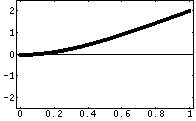
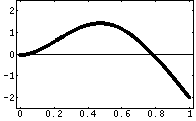
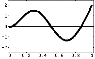
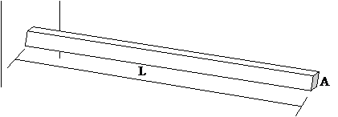
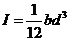
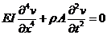
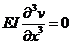
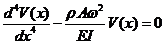
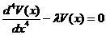

### Theory

**A. Background:**

**a. Beams and Cantilever**
        Beams are structural members that have smaller dimensions of cross sections compared to its length (its axis) and are subjected to loads perpendicular to its axis; i.e. they are subjected to transverse loads. The whole beam deforms in the plane containing the axis and the transverse loads. We say that the beam bends. The beams are usually supported at both ends and they are termed differently depending on the support conditions. When one end of a beam is fixed, and the other free, it is called a Cantilever beam, or simply a Cantilever. When both end-supports re simple, the beam is called a Simply Supported Beam. If both ends of a beam are fixed, it is a Fixed-Fixed Beam or simply a Fixed Beam.

**b. Physical systems that can be modelled as cantilever:**
        The diving board on a swimming pool, the slab on a porch, wall mounted structures, overhanging booms of cranes, etc can be modelled as cantilever. These physical systems can be idealized with loss of some accuracy and generalization but ability and simplicity of analysis. The vibration characteristics of these systems can be very well understood by knowing the vibrations of its cantilever model.

As explained in the general theory, the characteristics of natural vibration are extremely important in knowing the response of the systems to forced excitations.

In this experiment, we shall find out the natural frequencies of a cantilever from its response to harmonic support-excitation.

**c. Natural Vibration of a Cantilever - Natural frequencies and mode shapes**
        A Cantilever is a continuous system-its mass and elasticity are distributed all over its volume. It can be considered to have infinite very small masses connected by infinite very small springs resist the banding of the Cantilevers. Hence there are infinite degrees of freedom and infinite natural frequencies. And also, corresponding to every natural frequency, it has a particular shape of vibration, called Mode Shape. The lowest natural frequency is called Fundamental natural frequency and corresponding mode, fundamental mode or simply the first mode. Here are animations for first three modes of vibration of a Cantilever. Click on the figures to see the modes.

<table><tr>
<td></td>
<td></td>
<td></td>
</tr><tr>
<td>Mode - I</td>
<td>Mode - II</td>
<td>Mode - III</td>
</tr>
</table>

 A cantilever of rectangular cross section bxd; Area of cross-section, A = bxd; and length L is shown in the figure. Cross-sectional dimensions are small compared to its length.
 

 
 Let us consider its natural vibration in vertical plane, perpendicular to its length L. Let I be the second moment of the area of cross section about neutral axis perpendicular to the plane of vibration; 
 
 Let E be the modulus of elasticity of the material from which the cantilever is made. For steel value E is taken as E = 210GPa (210x109 N/m2) and for Aluminium, it is 70 GPa Let ρ be the density of the material; for steel, &rho; = 7800 kg/m3; for Aluminium, &rho; = kg/m3
 
 **d. Equation of Motion**
       Once disturbed from its position of equilibrium and left to its own, the cantilever will vibrate naturally; it will perform natural vibration. From theory, we know that the vibration of a cantilever is governed by the equation
	   

at x = 0 (i.e. at fixed end): Deflection v(0,t) = 0 and Slope dv(0,t)/dx = 0, at all t and at x = L (i.e. at free end), Bending moment

 
 and Shear force
 

 
 The initial condition is v(x,0) = 0 As both, boundary conditions and initial conditions, are specified, the problem is said to be of mixed initial value and boundary value problem.
For small amplitudes of vibration of the cantilever, the motion can be assumed to be harmonic and we can write this equation in terms of amplitude of vibration as a function of x alone. The equation is as follows:

 and Shear force
 

 
 There are infinite sets of V(x) and &lambda; which together satisfy the above equation. Such problems are called Eigenvalue problems and the solutions are called eigenvalues &lambda;i, and eigenvectors V(x)i.    
V(x) is function of x that shows shape of the cantilever (Amplitudes of vibration at different values of x) corresponding to the respective frequencies of natural vibration &lambda;i. The shape of cantilever vibrating with certain natural frequency is called mode shape of cantilever for that frequency. Three of them were shown in figures earlier.

**e. Impact test, excited modes and natural frequencies**
        When a cantilever is given an impact at some point, it is set into vibration. In general, the cantilever will not vibrate in any one single natural mode with corresponding single natural frequency of vibration. Rather, number of modes will participate in its vibration depending on the point of impact with corresponding natural frequencies as components of the periodic vibration. In an impact test, an accelerator is fitted at some point on the cantilever and the cantilever is hit with an impact hammer giving an impulse to the cantilever. FFT analysis of the signal received from the load cell fitted at the tip of the impact hammer reveals that it contains all frequencies over a range. Similarly, the FFT analysis of the signal will also reveal that it contains all those frequencies but amplitude of vibration corresponding to the natural frequencies will be high. Exactly this phenomenon is used to identify the natural frequencies of the cantilever by impact test. Ratio of signals received from the accelerometer and that of the impact hammer is taken in frequency domain which is called FRF (Frequency Response Function). The accelerometer is fixed at one point on the cantilever and impulse is given at predetermined points with the impulse hammer. Corresponding FRFs are computed using the software of modal analysis. Using techniques of curve fitting, Modal Identification Function is generated that shows peaks at the natural frequencies with the selected range of frequencies. And thus the natural frequencies of the cantilever are found by the impact test.
 